# Mermaid 다이어그램 예시 가이드

포트폴리오에서 자주 사용되는 Mermaid 다이어그램 패턴들을 정리한 가이드입니다.

---

## 📊 시스템 아키텍처 다이어그램

### 기본 웹 애플리케이션 구조

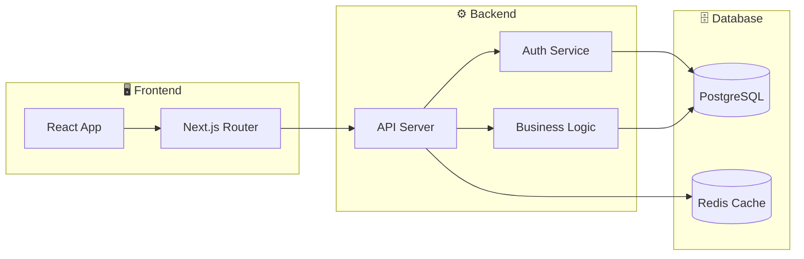

### 마이크로서비스 아키텍처

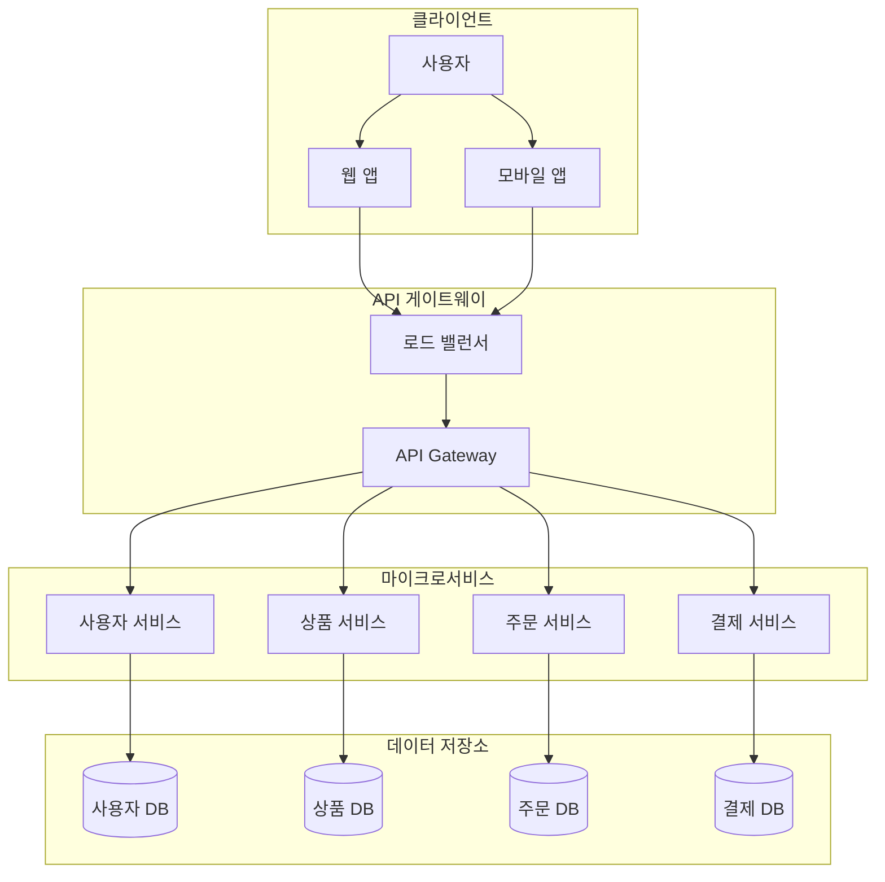

### 클라우드 인프라 구조

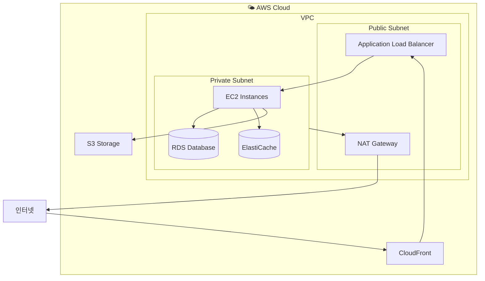

---

## 🔄 플로우차트

### 사용자 인증 플로우

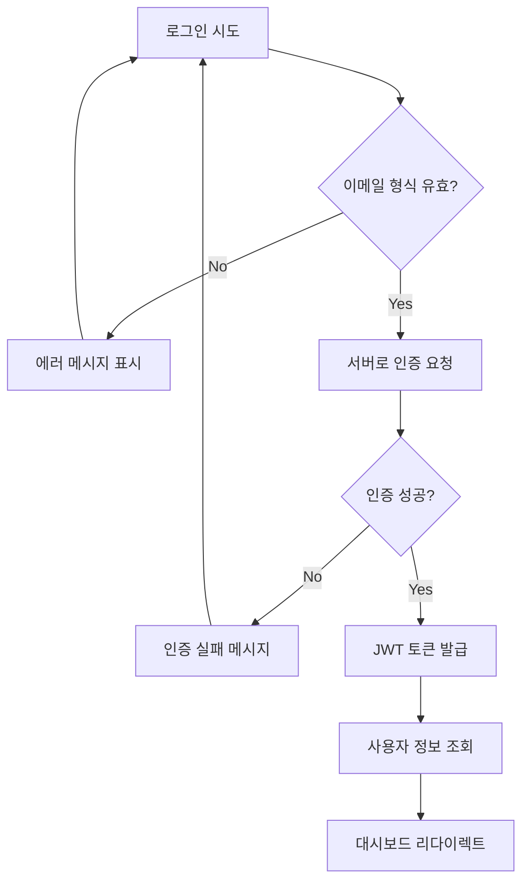

### 데이터 처리 플로우

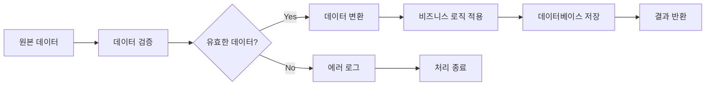

### CI/CD 파이프라인

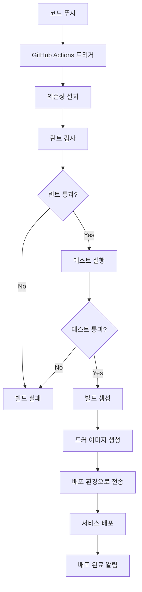

---

## 📝 시퀀스 다이어그램

### API 호출 시퀀스

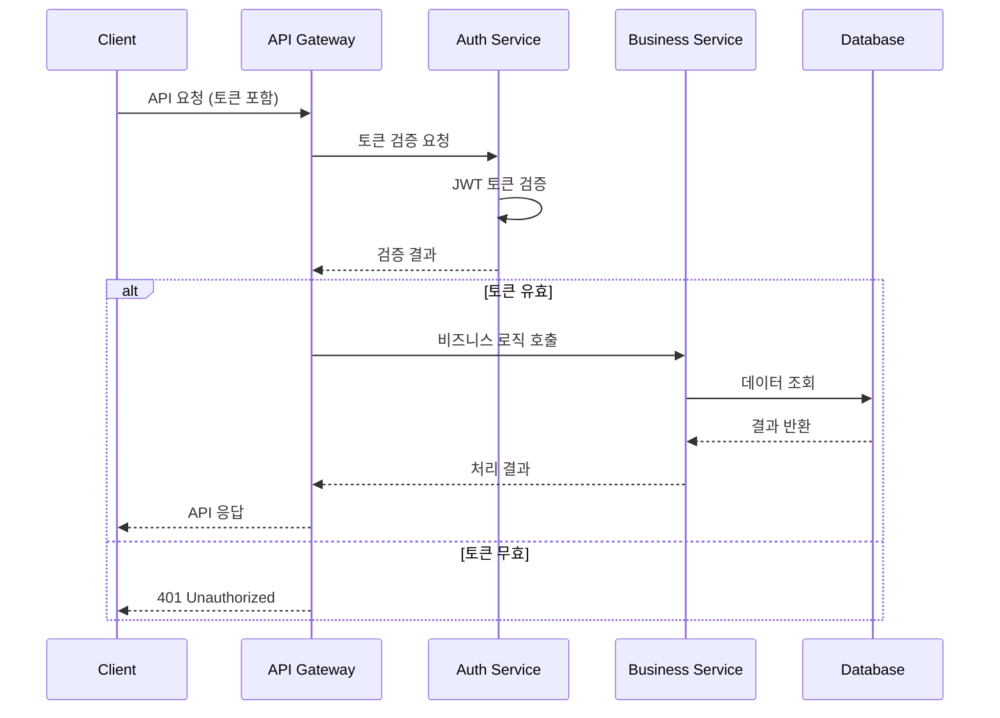

### 결제 처리 시퀀스

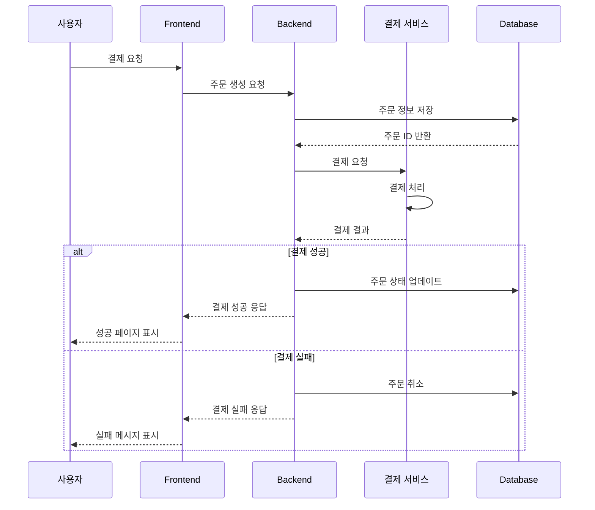

---

## 🏗️ ER 다이어그램

### 기본 사용자-게시물 관계

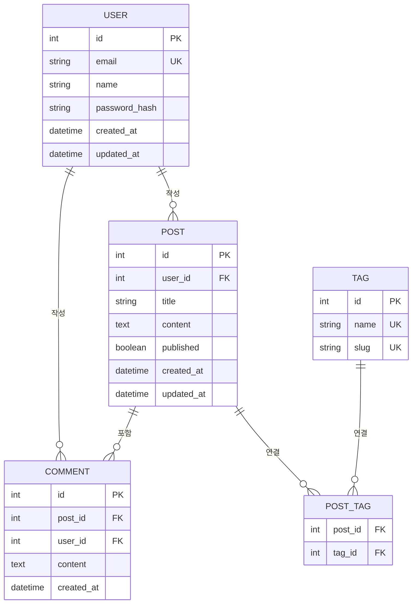

---

## 🎯 간단한 다이어그램 패턴

### 기본 클라이언트-서버 구조

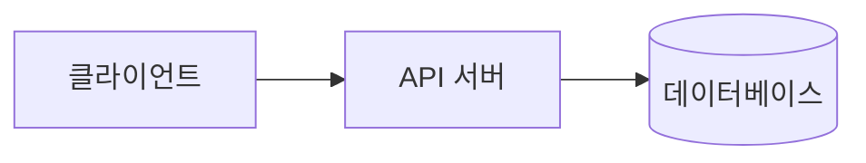

### 3-Tier 아키텍처

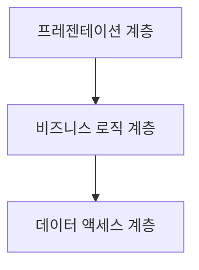

### 마이크로프론트엔드

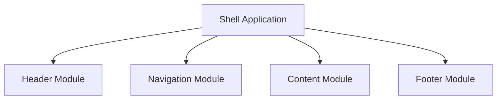

---

## 📋 사용 가이드

### 색상과 아이콘 활용

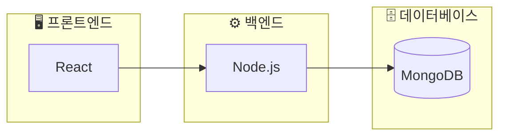

### 조건부 플로우 표현

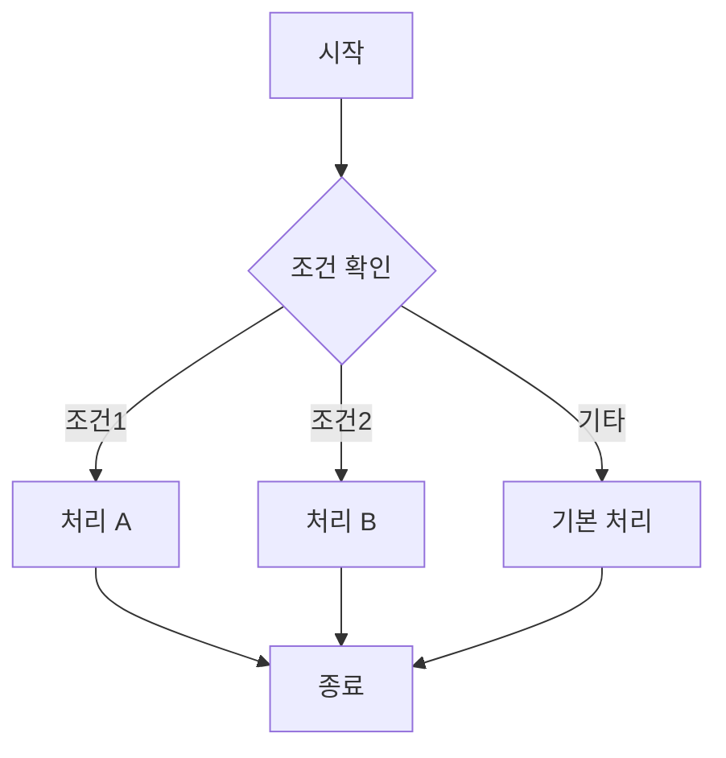

---

## ⚠️ 주의사항

1. **백틱 이스케이프**: 템플릿 리터럴에서는 `\`\`\`mermaid`로 시작
2. **다이어그램 타입**: `graph`, `flowchart`, `sequenceDiagram`, `erDiagram` 등
3. **방향 지정**: `LR` (좌→우), `TD` (위→아래), `BT` (아래→위), `RL` (우→좌)
4. **서브그래프**: 관련 요소들을 그룹화할 때 사용
5. **스타일링**: 이모지와 색상을 활용하여 가독성 향상

---

## 🔗 참고 링크

- [Mermaid 공식 문서](https://mermaid-js.github.io/mermaid/)
- [Mermaid Live Editor](https://mermaid.live/)
- [GitHub Mermaid 지원](https://docs.github.com/en/get-started/writing-on-github/working-with-advanced-formatting/creating-diagrams)