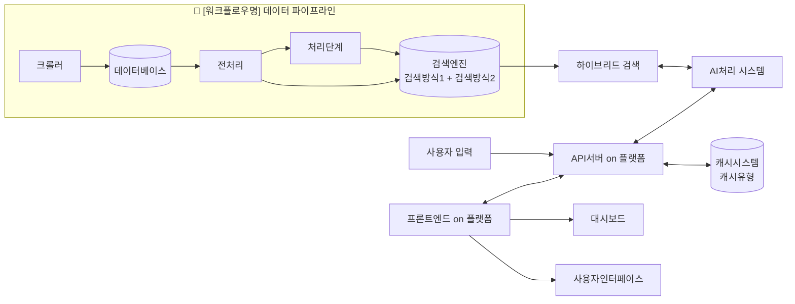

# 프로젝트 마크다운 템플릿

이 템플릿을 복사하여 새로운 프로젝트의 `markdownContent` 필드에 사용하세요.

---

## [프로젝트 제목/기술명] 기반 [프로젝트 유형] 시스템

-----

### 프로젝트 개요

이 프로젝트는 [문제점/요구사항]을 해결하기 위해 [주요 기술]을 활용하여 구축된 [프로젝트 유형]입니다. [프로젝트의 핵심 가치와 목표를 1-2문장으로 설명]

### 나의 역할: [주요 역할명]

[자신이 담당한 핵심적인 역할과 책임 범위를 1-2문장으로 설명]

#### 1. [첫 번째 주요 업무 영역]

- **[세부 업무 1명]**:
  - [구체적인 실행 내용과 방법]
  - **사용 기술**과 **도구명**을 활용한 [구체적인 구현 내용]

- **[세부 업무 2명]**:
  - [또 다른 실행 내용]
  - **기술명** 모델/라이브러리를 사용하여 [구체적인 성과]
  - [결과물이나 성과를 정량적으로 표현]

#### 2. [두 번째 주요 업무 영역]

- **[업무명]**: **기술명**으로 구축된 [결과물]을 **플랫폼명**을 통해 [목적]. **추가기술**을 사용하여 [세부 구현사항].

-----

### 주요 기능

- **[기능명 1]**: [기능 설명]. **사용기술**에 [데이터 저장/처리 방식] 후, **다른기술**에 [처리 결과].
- **[기능명 2]**: **기술명** 내에서 [구체적인 처리 방식]을 결합하여 [달성 목표].
- **[기능명 3]**: **프레임워크명** 기반의 [시스템 유형]이 [데이터 소스]를 바탕으로 [결과물 생성].
- **[기능명 4]**: **API기술**을 사용하여 [프로젝트 기능]을 [접근 방식]할 수 있도록 [API 특징] 제공.

-----

### 기술 스택

- **Backend**: **[언어1]**, **[프레임워크1]**, **[라이브러리1]**, **[도구1]**, **[도구2]**
- **Frontend**: **[프레임워크2]**, **[언어2]**, **[빌드도구]**, **[CSS프레임워크]**, **[HTTP클라이언트]**, **[차트라이브러리]**
- **Data**: **[크롤링도구1]**, **[파싱도구]**, **[ML라이브러리]**
- **Infra**: **[클라우드DB]**, **[검색엔진]**, **[캐시]**, **[워크플로우도구]**, **[컨테이너]**, **[배포플랫폼1]**, **[배포플랫폼2]**

-----

### 시스템 아키텍처

-----

### 성과 및 결과

- **[정량적 성과 1]**: [구체적인 수치나 개선 결과]
- **[정량적 성과 2]**: [성능 향상 지표나 사용자 경험 개선 내용]
- **[기술적 성과]**: [학습한 기술이나 적용한 새로운 방법론]

---

## 📝 작성 가이드

### 필수 수정 항목
1. **[대괄호] 내용**: 프로젝트에 맞게 모든 대괄호 내용 수정
2. **기술명**: 실제 사용한 기술로 변경 (볼드 유지)
3. **Mermaid 다이어그램**: 프로젝트 아키텍처에 맞게 수정

### 작성 팁
- 기술명은 반드시 **볼드**로 작성
- 구체적인 수치와 성과 포함
- 본인의 기여도와 역할 명확히 표현
- 백틱(`) 사용 금지, 볼드(**)로 대체

### 예시 참고
현재 구현된 "망망대 AI 프로젝트"를 참고하여 작성 스타일을 맞춰주세요.